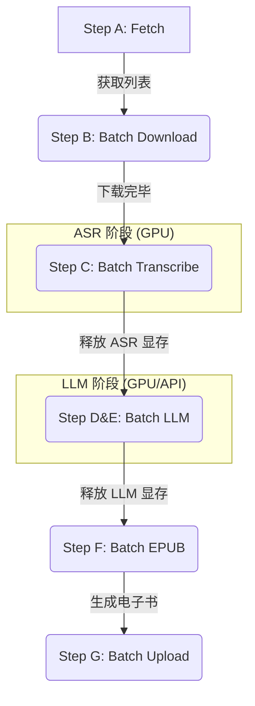

# Bilibili Summarizer 流程说明 (V3 Batch Edition)

> 将 B站"稍后再看"视频自动转录为文字，用 Qwen3 校正+总结，生成 EPUB 电子书，上传微信读书。
> **V3 特性**：采用批量处理管道（Batch Pipeline），支持 12GB 显卡的显存自动回收与断点续传。

## 📊 批量处理管道架构

为了优化显存占用，整个流程分为四个主要的**批量阶段**，阶段间会自动释放 GPU 资源：



---

## 🔄 命令说明

### Step A: 获取视频列表
```powershell
python main.py fetch
```

### Step B: 下载音频
```powershell
python main.py download --max-items 5
```

### Step BA: AI 智能过滤 (Qwen)
- 自动运行：`python main.py run`
- 逻辑：根据标题和 UP 主判断是否值得转录。
- 过滤：游戏、影视解说、硬核代码教程等。
- 保留：AI 新闻、科普、访谈、播客等。

### Step C: 语音转文字 (Whisper)
```powershell
python main.py transcribe --max-items 5 --whisper-model large-v3
```
→ 输出: `{标题}.md`

### Step D: 校正文本 (Qwen3)
```powershell
python main.py correct --max-items 5
```
- 使用 `prompts/correct.txt`
- 逐段校正错别字和乱码
→ 输出: `{标题}.corrected.md`

### Step E: 生成摘要 (Qwen3)
```powershell
python main.py summarize --max-items 5
```
- 使用 `prompts/summarize.txt`
- 生成内容摘要 + 要点列表
→ 输出: `{标题}.final.md` (摘要 + 校正后全文)

### Step F: 生成 EPUB
```powershell
python main.py epub
```

### Step G: 上传微信读书
```powershell
python main.py upload --max-items 5
```

---

## ⚡ 快捷命令

```powershell
# 查看状态
python main.py status

# 一键运行全部 (A → F)
python main.py run --max-items 10 --whisper-model large-v3
```

---

## 📁 输出文件

| 步骤 | 文件 | 说明 |
|------|------|------|
| Step C | `{标题}.md` | Whisper 原始转录 |
| Step D | `{标题}.corrected.md` | 校正后的文本 |
| Step E | `{标题}.final.md` | 摘要 + 校正文本 |
| Step F | `{标题}.epub` | 电子书 |

---

## 🔧 Prompt 自定义

| 文件 | 用途 |
|------|------|
| `prompts/correct.txt` | 文本校正 prompt |
| `prompts/summarize.txt` | 内容总结 prompt |

**变量说明**：
- `{text}` - 原文/转录文本
- `{title}` - 视频标题
- `{author}` - UP主名称

---

## 🤖 模型配置

`config.yaml`:

```yaml
# Whisper 语音识别
whisper:
  model: "large-v3"
  language: null  # 自动检测

# Ollama LLM (Qwen3)
ollama:
  model: "qwen3:8b"
  base_url: "http://localhost:11434"
```

**模型存储位置**：
- Whisper: `E:/ai_models/whisper/`
- Ollama: `E:/ai_models/ollama/`
- HuggingFace: `E:/ai_models/huggingface/`
