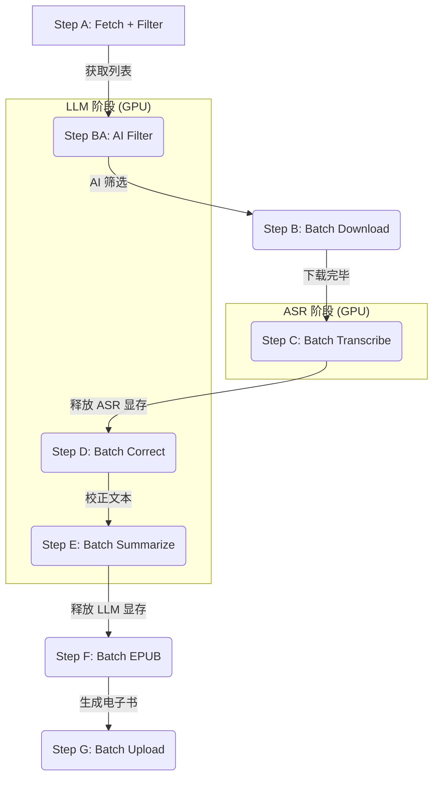

# Bilibili Summarizer 流程说明 (V3)

> 将 B站"稍后再看"视频自动转录为文字，用 Qwen3 校正+总结，生成 EPUB 电子书，上传微信读书。
> **V3 特性**：批量处理管道，显存自动回收，断点续传，AI 智能过滤。

## 📊 批量处理管道架构

为优化显存占用，整个流程分为多个**批量阶段**，阶段间自动释放 GPU 资源：



---

## 🔄 步骤详解

### Step A: 获取视频列表
```powershell
python main.py fetch
```
- 调用 Bilibili API 获取稍后再看列表
- 应用 `filters.yaml` 规则（时长、UP 主黑名单、标题正则）
- 生成 `pipeline_queue.json`

### Step BA: AI 智能过滤 (Qwen3)
- 自动在 `python main.py run` 中运行
- 使用 `prompts/filter.txt` 判断视频是否值得转录
- 过滤：游戏、影视解说、硬核代码教程、数学/理科学习类
- 保留：AI 新闻、科普、访谈、播客

### Step B: 下载音频
```powershell
python main.py download --max-items 5
```
- 使用 yt-dlp 并行下载视频音频
- 输出: `output/media/{bvid}_{标题}.m4a`

### Step C: 语音转文字 (Qwen3-ASR / Whisper)
```powershell
python main.py transcribe --max-items 5
```
- 使用本地 ASR 模型转录音频
- 支持说话人分离（diarization）
- 输出: `output/transcripts/{标题}.md`

### Step D: 校正文本 (Qwen3 8B)
```powershell
python main.py correct --max-items 5
```
- 使用 `prompts/correct.txt` 逐段校正
- 添加标点、分段、修正错别字、保留说话人标签
- 支持双语校正（非中文内容保留原文+中文翻译）
- 输出: `output/transcripts/{标题}.corrected.md`

### Step E: 生成摘要 (Qwen3 8B)
```powershell
python main.py summarize --max-items 5
```
- 使用 `prompts/summarize.txt` 生成结构化摘要
- 包含：核心摘要、要点列表、总结与建议
- 输出: `output/transcripts/{标题}.final.md`（摘要 + 校正后全文）

### Step F: 生成 EPUB
```powershell
python main.py epub
```
- **优先使用 `.final.md`（含摘要）**，无摘要时回退到 `.corrected.md` 或 `.md`
- 输出: `output/epub/{标题}.epub`

### Step G: 上传微信读书
```powershell
python main.py upload --max-items 5
```
- 使用 Playwright 浏览器自动化上传

---

## ⚡ 快捷命令

```powershell
# 查看状态
python main.py status

# 一键运行全部 (A → G)
python main.py run --max-items 10
```

---

## 📁 输出文件

| 步骤 | 文件 | 说明 |
|------|------|------|
| Step C | `{标题}.md` | ASR 原始转录 |
| Step D | `{标题}.corrected.md` | 校正后的文本 |
| Step E | `{标题}.final.md` | **摘要 + 校正文本**（EPUB 优先使用） |
| Step F | `{标题}.epub` | 电子书 |

---

## 🔧 Prompt 自定义

| 文件 | 用途 | 变量 |
|------|------|------|
| `prompts/filter.txt` | AI 过滤 | `{title}`, `{author}` |
| `prompts/correct.txt` | 文本校正 | `{text}`, `{title}`, `{author}`, `{speaker_map}`, `{language_hint}` |
| `prompts/summarize.txt` | 内容总结 | `{text}`, `{title}`, `{author}` |
| `prompts/identify_speakers.txt` | 说话人识别 | `{text}`, `{title}`, `{author}` |

---

## 🤖 模型配置

`config.yaml`:

```yaml
# 语音识别引擎
asr_engine: "qwen_asr"  # 或 "whisper"

# Ollama LLM (Qwen3)
ollama:
  model: "qwen3:8b"
  base_url: "http://localhost:11434"
```

**模型存储位置**：
- HuggingFace: `E:/ai_models/huggingface/`
- Ollama: `E:/ai_models/ollama/`

---

## 🧪 测试

```powershell
& "e:\bilibili_summarizer_v3\venv\Scripts\python.exe" -m pytest tests/ -v
```

41 个回归测试，无需 GPU/网络，< 1 秒运行。详见 [TESTING.md](TESTING.md)。

---

## 📊 状态流转

一个视频在流水线中的状态变化：

```
new → downloading → downloaded → transcribing → transcript_ready
    → correcting → corrected → summarizing → summarized → success → uploaded
```

特殊状态：
- `error` — 任何步骤失败（可重试）
- `skipped` — AI 过滤跳过
- `skipped_old` — 太旧跳过
